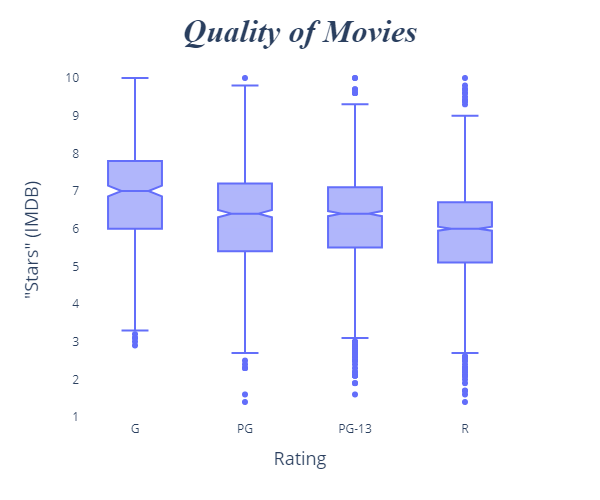
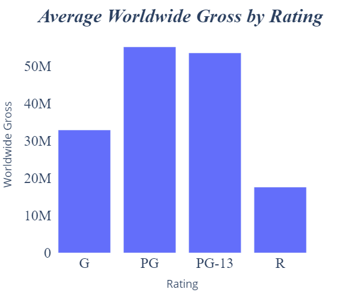
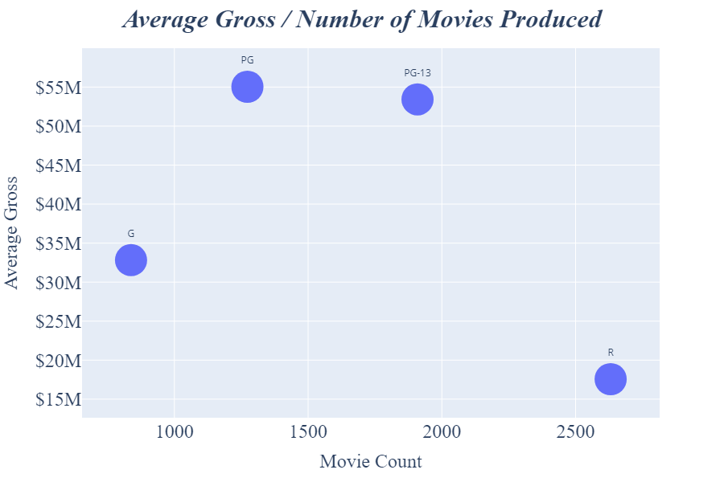
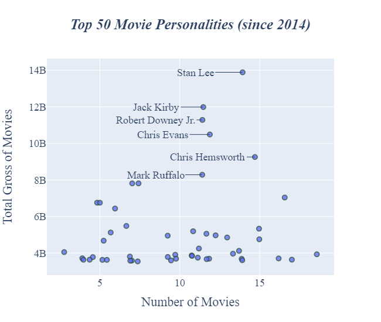
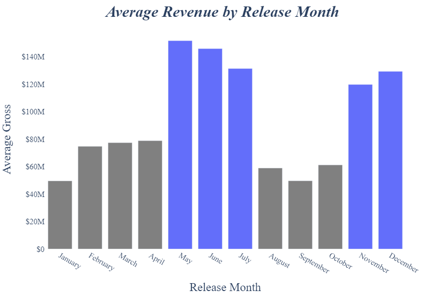

#### Final Project Submission

Please fill out:
* Student name: **Claude Fried**
* Student pace: **Part-time**
* Scheduled project review date/time: **June 11, 2020**
* Instructor name: **James Irving**
* Blog post URL: https://cwf231.github.io/template_for_web_scraping_-_beautifulsoup


# Intro

***For this project, I was asked to do data analysis of the movie industry for Microsoft's inaugural movie. After researching the movie industry, I needed to determine some actionable insights in order to know what type of films they should be creating.***
***
*The first thing I needed to do was create a list of aspects I wanted to research.*

*Once I had a broad idea of the topics I wanted to cover, I got more specific and thought of some relevant questions to answer.*

*Finally, I began digging into the data provided and scraping for data I thought I would need. With each question, I created a visualization which offered insight into the answer.*

*I then used the visualization's conclusion to help offer an actionable insight.*

## Identify POIs.
> '*Your team is charged with doing data analysis and creating a presentation that explores what type of films are currently doing the best at the box office. You must then translate those findings into actionable insights that the CEO can use when deciding what type of films they should be creating.*'

> * *Types of films*:
>  * Genre.
>  * Movie Rating.
>  * Personnel (actors / directors / writers)
>  * Release (month)

> * *Expenses*
>  * Budget
>  * Gross
>  * Profit


```python
import pandas as pd
import numpy as np

import requests
from bs4 import BeautifulSoup
import urllib
import shutil

from PIL import Image

from IPython.display import Image, HTML
from ipywidgets import Image, Layout
from ipywidgets import HTML
from ipywidgets import HBox, VBox
from ipywidgets import interactive

import re
import time

import os

import plotly.graph_objs as go
import plotly.express as px
from plotly.subplots import make_subplots

import chart_studio
import chart_studio.plotly as py
import chart_studio.tools as tls
```

## Data Gathering and Cleanup

### Read files in the directory.


```python
def get_df_lst(directory='zippedData/'):
    """Returns a list of dataframes from the csv/tsv files in the directory."""
    file_lst = os.listdir(directory)
    
    df_lst = []
    for filename in file_lst:        
        if '.tsv' in filename:
            sep = '\t'
        else:
            sep = ','
            
        encoding = 'latin-1'
        
        df = pd.read_csv(
            f'{directory}{filename}', 
            index_col=0, 
            sep=sep, 
            encoding=encoding,
            )
            
        print(filename)
        df_lst.append(df)
        
    print('\n\nComplete.')
    return df_lst
```


```python
df_lst = get_df_lst()
print('Files uploaded:', len(df_lst))
```

    bom.movie_gross.csv.gz
    imdb.name.basics.csv.gz
    imdb.title.akas.csv.gz
    imdb.title.basics.csv.gz
    imdb.title.crew.csv.gz
    imdb.title.principals.csv.gz
    imdb.title.ratings.csv.gz
    rt.movie_info.tsv.gz
    rt.reviews.tsv.gz
    tmdb.movies.csv.gz
    tn.movie_budgets.csv.gz
    
    
    Complete.
    Files uploaded: 11
    

#### Identify and organize given data.


```python
movie_gross_df = df_lst[0] # Production studio. Domestic & foreign gross. Year.

people_df = df_lst[1] # IDs for: Actors, producers, directors, etc.
foriegn_title_df = df_lst[2] # Foreign titles, region. *Not useful.
movie_info_imdb_df = df_lst[3] # Year, runtime, genre.
director_writer_df = df_lst[4] # Director and writer for each movie_id.
people_jobs_df = df_lst[5] # People working on a movie (person_id).
rating_and_votes_df = df_lst[6] # Rating and numvotes. *Not useful.

movie_info_rt_df = df_lst[7] # Genre, movie_rating, director/writer, 
                             # theater/dvd date, runtime, studio.
ratings_and_reviews_rt_df = df_lst[8] # Review and review dates.

movie_info_tmdb_df = df_lst[9] # Link title & movie_id. Popularity, genres, etc.

movie_budgets_and_gross_df = df_lst[10] # Production budget, 
                                        # domestic/worldword gross.
```

### Scraping for more data.

* Release schedule.

https://www.the-numbers.com/movies/release-schedule/2007

* Cumulative worldwide box office gross.

https://www.the-numbers.com/box-office-records/worldwide/all-movies/cumulative/released-in-2007

* 1000 Highest movie budgets.

https://www.the-numbers.com/movie/budgets/all


##### Helper functions.


```python
def valid_row(entries, desired):
    """Returns if the length of entries is the desired length."""
    return len(entries) == desired


def clean_date(string, year=''):
    """Returns a datetime object from a string, else np.nan.
    Passing a year in addition to the string is optional."""
    if type(string) == pd.Timestamp:
        return string
    try:
        return pd.to_datetime(f'{string} {year}')
    except:
        return np.nan
    

def clean_movie_title(string):
    """Returns a slice of the string up to the '(' character."""
    if '(' in string:
        return string[:string.find('(')]
    return string


def clean_box_office(string):
    """Return an int of a string (scrubbing '$' and ','), else np.nan."""
    cleaned = string.replace('$', '').replace(',', '').strip()
    try:
        return int(cleaned)
    except ValueError:
        return np.nan

    
def clean_percent(string):
    """Returns a percent value of a string, else np.nan.
    Cleans '%' character.
    All values between 0 and 1."""
    try:
        return float(string.replace('%', '')) / 100
    except ValueError:
        return np.nan
    
    
def additional_pages_on_box_office_page(url):
    """Runs a requests.get(url).
    Returns a list of urllib.parse.urljoin() for specific webpage format
    (the-numbers.com)."""
    req_get = requests.get(url)
    soup = BeautifulSoup(req_get.content)
    
    return [urllib.parse.urljoin(url, a['href']) 
            for a in soup.find('div', class_='pagination').findAll('a')]
```

##### Stopwatch


```python
# Build a simple stopwatch/timer 
# to make sure I'm not using requests.get() too quickly.


class Stopwatch:
    def __init__(self):
        self.start_time = None
        self.stop_time = None
    
    def start_timer(self):
        """Set self.start_time as current time."""
        self.start_time = time.time()
        if self.stop_time:
            self.stop_time = None
    
    def stop_timer(self):
        """Set self.stop_time as current time."""
        self.stop_time = time.time()
        
    def elapsed_time(self):
        """Returns the difference between start_time and stop_time, else 0."""
        if self.start_time and self.stop_time:
            return round(self.stop_time - self.start_time, 2)
        else:
            return 0
    
    def total_time_to_elapse(self, seconds):
        """Forces x seconds to elapse (inclusive of the elapsed time on the
        stopwatch's internal timer."""
        remainder = seconds - self.elapsed_time()
        if remainder > 0:
            time.sleep(remainder)
```

##### Color variable.


```python
PLOTLY_BLUE = '#636efa'
```

#### Release schedule.


```python
# Define a function to return a dataframe of release dates for movies
# from a given year to an end year (2007 - 2019).


def scrape_release_schedule(start_year=2007, end_year=2019):
    """Scrape the-numbers website for release dates. Returns a dataframe."""
    main_url = 'https://www.the-numbers.com'
    
    # Lazy compiling of urls for years.
    url_lst = [
        f'{main_url}/movies/release-schedule/{year}'
        for year in range(start_year, end_year+1)
    ]
    
    release_date_lst = []
    movies_lst = []
    distributors_lst = []
    domestic_box_lst = []
    trailers_lst = []
    
    # Initialize stopwatch.
    stopwatch = Stopwatch()
    
    for url in url_lst:
        # Keep track of how many entries have been saved.
        print(len(movies_lst))
        
        stopwatch.start_timer()
        
        year = url[-4:]
        
        req_get = requests.get(url)
        soup = BeautifulSoup(req_get.content)
        
        # All data is already formatted in a table on the site.
        table = soup.findAll('table')[1]
        rows = table.findAll('tr')
        
        for row in rows:
            entries = row.findAll('td')
            if valid_row(entries, 5):
                # Clean data.
                date = entries[0].text
                if date == '':
                    date = release_date_lst[-1]
                date = clean_date(date, year)
                movie = clean_movie_title(entries[1].text)
                distributor = entries[2].text
                domestic_box = clean_box_office(entries[3].text)
                trailer = entries[4].text
                
                release_date_lst.append(date)
                movies_lst.append(movie)
                distributors_lst.append(distributor)
                domestic_box_lst.append(domestic_box)
                trailers_lst.append(trailer)
        
        # Force wait for 3 seconds (total) before next request.
        stopwatch.stop_timer()
        stopwatch.total_time_to_elapse(3)
    
    df = pd.DataFrame(
        [release_date_lst, movies_lst, distributors_lst, 
         domestic_box_lst, trailers_lst]
        ).transpose()
    
    df.columns = [
        'release_date', 'movie', 'distributor', 
        'domestic_box_office_to_date', 'trailer'
    ]
    
    print('Complete.')
    return df
```


```python
# Scrape or open files.
if 'release_schedule_df.csv' in os.listdir('scraped_data/'):
    release_schedule_df = pd.read_csv('scraped_data/release_schedule_df.csv', 
                                      index_col=0)
else:
    release_schedule_df = scrape_release_schedule()
    release_schedule_df.to_csv('scraped_data/release_schedule_df.csv')
```

#### Cumulative worldwide box office gross.


```python
# Define a function to return a dataframe with the top grossing movies worldwide
# from a starting year to an ending year.


def scrape_worldwide_box_office_gross(start_year=2007, end_year=2019):
    """Scrape the-numbers website for top grossing movies. 
    Returns a dataframe."""
    
    # Lazy compiling of urls for years.
    main_url = 'https://www.the-numbers.com'
    url_lst = [
        f'{main_url}/box-office-records/worldwide/all-movies/cumulative/released-in-{year}' 
        for year in range(start_year, end_year+1)
    ]
    
    # Initialize stopwatch.
    stopwatch = Stopwatch()

    # Gather all urls ('next page' urls) and add to the url_lst.
    additional_urls = []
    for url in url_lst:
        stopwatch.start_timer()
        
        additional_urls.append(additional_pages_on_box_office_page(url))
        
        stopwatch.stop_timer()
        stopwatch.total_time_to_elapse(3)
    
    # Adding list to master list (not .append()).
    for new_url_lst in additional_urls:
        url_lst += new_url_lst
    
    ranks_lst = []
    movies_lst = []
    worldwide_lst = []
    domestic_lst = []
    international_lst = []
    domestic_share_lst = []
    
    for url in url_lst:
        # Keep track of how many entries have been saved.
        print(len(movies_lst))
        
        stopwatch.start_timer()
        req_get = requests.get(url)
        soup = BeautifulSoup(req_get.content)
        
        table = soup.findAll('table')[1]
        rows = table.findAll('tr')
        
        for row in rows:
            # Data is formatted in a table already.
            entries = row.findAll('td')
            if valid_row(entries, 6):
                # Clean data.
                rank = int(entries[0].text)
                movie = entries[1].text
                world_gross = clean_box_office(entries[2].text)
                domestic_gross = clean_box_office(entries[3].text)
                international_gross = clean_box_office(entries[4].text)
                domestic_share = clean_percent(entries[5].text)
                
                ranks_lst.append(rank)
                movies_lst.append(movie)
                worldwide_lst.append(world_gross)
                domestic_lst.append(domestic_gross)
                international_lst.append(international_gross)
                domestic_share_lst.append(domestic_share)
        
        # Force wait for 3 seconds (total) before next request.
        stopwatch.stop_timer()
        stopwatch.total_time_to_elapse(3)
                
    df = pd.DataFrame(
        [ranks_lst, movies_lst, worldwide_lst, domestic_lst,
        international_lst, domestic_share_lst]
        ).transpose()
    
    df.columns = [
        'rank', 'movie', 'worldwide_gross', 'domestic_gross', 
        'international_gross', 'domestic_share'
    ]
    
    print('Complete.')
    return df
```


```python
# Scrape or open files.
if 'worldwide_box_df.csv' in os.listdir('scraped_data/'):
    worldwide_box_df = pd.read_csv('scraped_data/worldwide_box_df.csv', 
                                   index_col=0)
else:
    worldwide_box_df = scrape_worldwide_box_office_gross()
    worldwide_box_df.to_csv('scraped_data/worldwide_box_df.csv')
```

#### Movie budgets and gross.


```python
# Define a function to return a dataframe of movie budgets, domestic gross,
# and worldwide gross.


def scrape_budget_and_gross():
    """Scrape the-numbers website for movie budget and gross. 
    Returns a dataframe."""
    
    rank_lst = []
    release_date_lst = []
    movies_lst = []
    budgets_lst = []
    domestic_gross_lst = []
    worldwide_gross_lst = []
    
    url = 'https://www.the-numbers.com/movie/budgets/all'
    
    # Initialize the stopwatch.
    stopwatch = Stopwatch()
    
    while True:
        # Keep track of how many entries have been saved.
        print(len(movies_lst))
        
        stopwatch.start_timer()
        
        req_get = requests.get(url)
        soup = BeautifulSoup(req_get.content)
        
        table = soup.find('table')
        rows = table.findAll('tr')
        
        for row in rows:
            # Data already formatted in a table.
            entries = row.findAll('td')
            if valid_row(entries, 6):
                # Clean data.
                rank = int((entries[0].text).replace(',', ''))
                date = clean_date(entries[1].text)
                movie = entries[2].text
                budget = clean_box_office(entries[3].text)
                dom_gross = clean_box_office(entries[4].text)
                world_gross = clean_box_office(entries[5].text)
                
                rank_lst.append(rank)
                release_date_lst.append(date)
                movies_lst.append(movie)
                budgets_lst.append(budget)
                domestic_gross_lst.append(dom_gross)
                worldwide_gross_lst.append(world_gross)
        
        # Find url for 'next page' link. Break when there are no more pages.
        button_container = soup.find('div', class_='pagination')
        next_a = button_container.find(class_='active').nextSibling.nextSibling
        if next_a is None:
            break
        url = urllib.parse.urljoin(url,next_a['href'])
        
        # Force wait for 3 seconds (total) before next request.
        stopwatch.stop_timer()
        stopwatch.total_time_to_elapse(3)
         
                
    df = pd.DataFrame([
        rank_lst, release_date_lst, movies_lst, 
        budgets_lst, domestic_gross_lst, worldwide_gross_lst
    ]).transpose()
    
    df.columns = [
        'rank', 'release_date', 'movie', 'budget', 
        'domestic_gross', 'worldwide_gross'
    ]
    
    print('Complete.')
    return df
```


```python
# Scrape or open files.
if 'budget_and_gross_df.csv' in os.listdir('scraped_data/'):
    budget_and_gross_df = pd.read_csv('scraped_data/budget_and_gross_df.csv', 
                                      index_col=0)
else:
    budget_and_gross_df = scrape_budget_and_gross()
    budget_and_gross_df.to_csv('scraped_data/budget_and_gross_df.csv')
```

* release_schedule_df
* worldwide_box_df
* budget_and_gross_df

***

# Topics / Questions

# Genre

## Q1:

* ### Do certain genres yield more profit?


```python
movie_info_imdb_df.head()
```


<div>
<style scoped>
    .dataframe tbody tr th:only-of-type {
        vertical-align: middle;
    }

    .dataframe tbody tr th {
        vertical-align: top;
    }

    .dataframe thead th {
        text-align: right;
    }
</style>
<table border="1" class="dataframe">
  <thead>
    <tr style="text-align: right;">
      <th></th>
      <th>primary_title</th>
      <th>original_title</th>
      <th>start_year</th>
      <th>runtime_minutes</th>
      <th>genres</th>
    </tr>
    <tr>
      <th>tconst</th>
      <th></th>
      <th></th>
      <th></th>
      <th></th>
      <th></th>
    </tr>
  </thead>
  <tbody>
    <tr>
      <th>tt0063540</th>
      <td>Sunghursh</td>
      <td>Sunghursh</td>
      <td>2013</td>
      <td>175.0</td>
      <td>Action,Crime,Drama</td>
    </tr>
    <tr>
      <th>tt0066787</th>
      <td>One Day Before the Rainy Season</td>
      <td>Ashad Ka Ek Din</td>
      <td>2019</td>
      <td>114.0</td>
      <td>Biography,Drama</td>
    </tr>
    <tr>
      <th>tt0069049</th>
      <td>The Other Side of the Wind</td>
      <td>The Other Side of the Wind</td>
      <td>2018</td>
      <td>122.0</td>
      <td>Drama</td>
    </tr>
    <tr>
      <th>tt0069204</th>
      <td>Sabse Bada Sukh</td>
      <td>Sabse Bada Sukh</td>
      <td>2018</td>
      <td>NaN</td>
      <td>Comedy,Drama</td>
    </tr>
    <tr>
      <th>tt0100275</th>
      <td>The Wandering Soap Opera</td>
      <td>La Telenovela Errante</td>
      <td>2017</td>
      <td>80.0</td>
      <td>Comedy,Drama,Fantasy</td>
    </tr>
  </tbody>
</table>
</div>


```python
budget_and_gross_df.head()
```


<div>
<style scoped>
    .dataframe tbody tr th:only-of-type {
        vertical-align: middle;
    }

    .dataframe tbody tr th {
        vertical-align: top;
    }

    .dataframe thead th {
        text-align: right;
    }
</style>
<table border="1" class="dataframe">
  <thead>
    <tr style="text-align: right;">
      <th></th>
      <th>rank</th>
      <th>release_date</th>
      <th>movie</th>
      <th>budget</th>
      <th>domestic_gross</th>
      <th>worldwide_gross</th>
    </tr>
  </thead>
  <tbody>
    <tr>
      <th>0</th>
      <td>1</td>
      <td>2019-04-23</td>
      <td>Avengers: Endgame</td>
      <td>400000000</td>
      <td>858373000</td>
      <td>2797800564</td>
    </tr>
    <tr>
      <th>1</th>
      <td>2</td>
      <td>2011-05-20</td>
      <td>Pirates of the Caribbean: On Stranger Tides</td>
      <td>379000000</td>
      <td>241063875</td>
      <td>1045663875</td>
    </tr>
    <tr>
      <th>2</th>
      <td>3</td>
      <td>2015-04-22</td>
      <td>Avengers: Age of Ultron</td>
      <td>365000000</td>
      <td>459005868</td>
      <td>1396099202</td>
    </tr>
    <tr>
      <th>3</th>
      <td>4</td>
      <td>2015-12-16</td>
      <td>Star Wars Ep. VII: The Force Awakens</td>
      <td>306000000</td>
      <td>936662225</td>
      <td>2068223624</td>
    </tr>
    <tr>
      <th>4</th>
      <td>5</td>
      <td>2018-04-25</td>
      <td>Avengers: Infinity War</td>
      <td>300000000</td>
      <td>678815482</td>
      <td>2048359754</td>
    </tr>
  </tbody>
</table>
</div>


```python
# Create relevant df.
genres_df = pd.merge(
    movie_info_imdb_df,
    budget_and_gross_df,
    left_on='original_title',
    right_on='movie',
    )[['movie', 'budget', 'worldwide_gross', 'genres']].dropna()
genres_df.head()
```


<div>
<style scoped>
    .dataframe tbody tr th:only-of-type {
        vertical-align: middle;
    }

    .dataframe tbody tr th {
        vertical-align: top;
    }

    .dataframe thead th {
        text-align: right;
    }
</style>
<table border="1" class="dataframe">
  <thead>
    <tr style="text-align: right;">
      <th></th>
      <th>movie</th>
      <th>budget</th>
      <th>worldwide_gross</th>
      <th>genres</th>
    </tr>
  </thead>
  <tbody>
    <tr>
      <th>0</th>
      <td>Foodfight!</td>
      <td>45000000</td>
      <td>73706</td>
      <td>Action,Animation,Comedy</td>
    </tr>
    <tr>
      <th>1</th>
      <td>Mortal Kombat</td>
      <td>20000000</td>
      <td>122133227</td>
      <td>Action,Adventure,Fantasy</td>
    </tr>
    <tr>
      <th>3</th>
      <td>The Overnight</td>
      <td>200000</td>
      <td>1165996</td>
      <td>Comedy,Mystery</td>
    </tr>
    <tr>
      <th>4</th>
      <td>On the Road</td>
      <td>25000000</td>
      <td>9313302</td>
      <td>Adventure,Drama,Romance</td>
    </tr>
    <tr>
      <th>5</th>
      <td>On the Road</td>
      <td>25000000</td>
      <td>9313302</td>
      <td>Drama</td>
    </tr>
  </tbody>
</table>
</div>


```python
# Break up genres column into a list of subgenres.
genres_df['genres'] = genres_df['genres'].map(lambda x: str(x).split(','))
```

* *Some movies are duplicate rows but with different genre labels.*


```python
# Duplicates example.
genres_df[genres_df['movie'] == 'On the Road']
```


<div>
<style scoped>
    .dataframe tbody tr th:only-of-type {
        vertical-align: middle;
    }

    .dataframe tbody tr th {
        vertical-align: top;
    }

    .dataframe thead th {
        text-align: right;
    }
</style>
<table border="1" class="dataframe">
  <thead>
    <tr style="text-align: right;">
      <th></th>
      <th>movie</th>
      <th>budget</th>
      <th>worldwide_gross</th>
      <th>genres</th>
    </tr>
  </thead>
  <tbody>
    <tr>
      <th>4</th>
      <td>On the Road</td>
      <td>25000000</td>
      <td>9313302</td>
      <td>[Adventure, Drama, Romance]</td>
    </tr>
    <tr>
      <th>5</th>
      <td>On the Road</td>
      <td>25000000</td>
      <td>9313302</td>
      <td>[Drama]</td>
    </tr>
    <tr>
      <th>6</th>
      <td>On the Road</td>
      <td>25000000</td>
      <td>9313302</td>
      <td>[Documentary]</td>
    </tr>
    <tr>
      <th>7</th>
      <td>On the Road</td>
      <td>25000000</td>
      <td>9313302</td>
      <td>[Drama]</td>
    </tr>
    <tr>
      <th>8</th>
      <td>On the Road</td>
      <td>25000000</td>
      <td>9313302</td>
      <td>[Documentary]</td>
    </tr>
    <tr>
      <th>9</th>
      <td>On the Road</td>
      <td>25000000</td>
      <td>9313302</td>
      <td>[Drama]</td>
    </tr>
  </tbody>
</table>
</div>


 * *Gather all genres for duplicate entries and set the genre.*


```python
# Isolate duplicated titles.
duplicated = genres_df[genres_df.duplicated('movie', keep=False)]


# Compile genres for all movies with the same title.
genres_dct = {} # {'movie_title':  ['cumlative', 'list', 'of', 'genres'], ...}
for i, info in duplicated.iterrows():
    movie, genres = info['movie'], info['genres']
    genres_dct[movie] = genres_dct.get(movie, []) + genres


# Set each movie's genre to their cumlative genres.
for movie, lst in genres_dct.items():
    genres_dct[movie] = list(set(genres_dct[movie]))


# Update genres_df['genre'] to a list using genres_df.at[...].
for movie in genres_dct:
    mini_df = genres_df.loc[genres_df['movie'] == movie, ['genres']]
    for i, info in mini_df.iterrows():
        genres_df.at[i, 'genres'] = genres_dct[movie]
```


```python
# Create profit and num_subcategories columns.
genres_df['profit'] = genres_df['worldwide_gross'] - genres_df['budget']
genres_df['num_subgenres'] = genres_df['genres'].map(lambda x: len(x))
```


```python
# Drop duplicate entries for movies titles.
genres_df.drop_duplicates(
    'movie', 
    keep='first', 
    ignore_index=True, 
    inplace=True,
    )
```

* Gather the cumlative profit based on genre subcategories.


```python
# Counter of individual instances of each genre sub-genre.
genre_freq_dct = {}
for genre_lst in list(genres_df['genres']):
    for genre in genre_lst:
        genre_freq_dct[genre] = genre_freq_dct.get(genre, 1) + 1
```


```python
# Since each genre is a list of categorical objects, the overall profit from
# each movie will be split evenly into each genre 'bin'.
tot_prof_dct = {}
for index, row in genres_df.iterrows():
    # Iterate over the list of sub-genres.
    for genre in row['genres']:
        split_profit = row['profit'] / len(row['genres'])
        tot_prof_dct[genre] = tot_prof_dct.get(genre, 0) + split_profit
```


```python
# Gather average profit for each genre subcategory. (Same method as above.)
avg_profit_per_genre_dct = {}
for genre in genre_freq_dct.keys():
    avg_profit_per_genre_dct[genre] = round(
        tot_prof_dct[genre] / genre_freq_dct[genre], 2
        )

avg_profit_per_genre = pd.Series(
                            avg_profit_per_genre_dct
                            ).sort_values()
```


```python
avg_profit_per_genre.head()
```


    Reality-TV      -71428.57
    News           2594347.27
    Western        8775418.53
    Sport          9519688.98
    History       10013821.80
    dtype: float64


- Visualizations


```python
# Create subplots.
genre_fig = make_subplots(
    rows=1, 
    cols=2, 
    shared_yaxes=True, 
    horizontal_spacing=0.01,
    subplot_titles=(
        '<b>Average Profit</b>',
        '<b>Profit Distribution</b>'
        )
    )

for i in genre_fig['layout']['annotations']:
    i['font'] = dict(family='Ariel', size=20)
```


```python
# Add 'Average Profit' bar chart to the left subplot. 
genre_fig.add_trace(
    go.Bar(
        x=avg_profit_per_genre,
        y=avg_profit_per_genre.index, 
        orientation='h',
        name='Average Profit',
        marker_color=(['grey'] * 20) + ([PLOTLY_BLUE] * 3)
        ),
    row=1, col=1
);
```


```python
# Add Boxplot of profit distribution for each movie in the sample using 
# list comprehension.
top_3_genres = ['Animation', 'Adventure', 'Sci-Fi']

[genre_fig.add_trace(
    go.Box(
        x=genres_df['profit'][
            genres_df['genres'].map(lambda genre_lst: genre in genre_lst)
        ],
        name=genre,
        marker_color= PLOTLY_BLUE if genre in top_3_genres else 'grey'
        ),
    row=1, col=2
    ) for genre in avg_profit_per_genre.keys()]

genre_fig.update_traces(boxpoints=False, row=1, col=2);
```


```python
# Layout.
genre_fig.update_layout(
    width=900,
    height=800,
    showlegend=False,
    title=dict(
        text="<b><i>The Effect of Movie Genre on Profit</i></b>",
        font=dict(family='Ariel', size=32),
        y=0.96,
        x=0.5,
        xanchor='center',
        yanchor='top'
        ),
    plot_bgcolor='rgba(0,0,0,0)',
    paper_bgcolor='rgba(0,0,0,0)' # Setting figure background to transparent.
)

genre_fig.update_yaxes(tickfont=dict(family='Ariel', size=20))
genre_fig.update_xaxes(tickfont=dict(family='Ariel', size=20))

# Dollar formatting
genre_fig.layout.xaxis['tickformat'] = '$s';
```

#### *Genre: Figure*


```python
# Uploading figures to plotly chart-studio.

genre_fig.write_image('figs/genre_fig.png')
# py.plot(genre_fig, filename='genre_fig', auto_open=False)
```


```python
# genre_fig
```


### Genre: Conclusion

*The charts show that **Animation**, **Adventure**, and **Sci-Fi** movies have the highest average profit.*

*To maximize expected profit, I would recommend producing a movie with these three sub-genres.*

# Rating


#### *Additional Scrape:* 
*IMDB: Title / Rating / Gross / Votes / 'Stars'*


```python
def scrape_ratings_and_populatiry():
    """Scrape IMDB for specific columns.
    Returns a dataframe."""
    
    url = 'https://www.imdb.com/search/title/?release_date=2014-01-01,&certificates=US%3AG,US%3APG,US%3APG-13,US%3AR,US%3ANC-17&sort=year,asc&count=250'

    title_lst = []
    rating_lst = []
    gross_lst = []
    votes_lst = []
    stars_lst = []
    
    # Initiate stopwatch.
    stopwatch = Stopwatch()

    while True:
        # Keep track of how many entries have been saved.
        print(len(title_lst))
        
        stopwatch.start_timer()

        req = requests.get(url)
        soup = BeautifulSoup(req.content)
        movie_container = soup.find('div', class_='lister-list')
        
        all_movies = movie_container.findAll(
            'div', class_='lister-item-content'
            )

        for movie in all_movies:
            # Clean data / insert np.nan when info or containers are not found.
            title = movie.find(
                'h3', class_='lister-item-header'
                ).find('a').text
            
            cert = movie.find('span', class_='certificate')
            if not cert:
                rating = np.nan
            else:
                rating = cert.text

            # Temp setting for votes / gross. Many values missing from page.
            votes = np.nan
            gross = np.nan
            
            bottom_container = movie.find('p', class_='sort-num_votes-visible')
            if bottom_container:
                spans = bottom_container.findAll('span')
                for i in range(len(spans)):
                    # Find the span that follows the label span.
                    span = spans[i]
                    if span.text == 'Votes:':
                        votes = spans[i+1]['data-value'].replace(',', '')
                    elif span.text == 'Gross:':
                        gross = spans[i+1]['data-value'].replace(',', '')
            
            # Sometimes the container is missing, sometimes the line is missing.
            stars_container = movie.find('div', class_='ratings-bar')
            if stars_container:
                stars_line = stars_container.find(
                    'div', class_='inline-block ratings-imdb-rating'
                    )
                if stars_line:
                    stars = stars_line.get('data-value', np.nan)
                else:
                    stars = np.nan
            else:
                stars = np.nan
            
            title_lst.append(title)
            rating_lst.append(rating)
            gross_lst.append(gross)
            votes_lst.append(votes)
            stars_lst.append(stars)
        
        # Find the next url and update url.
        next_url_container = soup.find(
            'a', class_='lister-page-next next-page'
            )
        if not next_url_container:
            break
        next_url = next_url_container['href']
        url = urllib.parse.urljoin(url, next_url)
        
        # Force wait for 3 seconds (total) before next request.
        stopwatch.stop_timer()
        stopwatch.total_time_to_elapse(3)


    df = pd.DataFrame(
        [title_lst, rating_lst, gross_lst, votes_lst, stars_lst]
        ).transpose()
    
    df.columns = ['title', 'rating', 'gross', 'votes', 'stars']
    return df
```


```python
# Scrape or open files.
if 'ratings_and_popularity_df.csv' in os.listdir('scraped_data/'):
    ratings_and_popularity_df = pd.read_csv(
        'scraped_data/ratings_and_popularity_df.csv', 
        index_col=0
        )
else:
    ratings_and_popularity_df = scrape_ratings_and_populatiry()
    ratings_and_popularity_df.to_csv(
        'scraped_data/ratings_and_popularity_df.csv'
        )
```

## Q2:
* ### Does movie rating affect viewer review?


```python
ratings_and_popularity_df.head()
```


<div>
<style scoped>
    .dataframe tbody tr th:only-of-type {
        vertical-align: middle;
    }

    .dataframe tbody tr th {
        vertical-align: top;
    }

    .dataframe thead th {
        text-align: right;
    }
</style>
<table border="1" class="dataframe">
  <thead>
    <tr style="text-align: right;">
      <th></th>
      <th>title</th>
      <th>rating</th>
      <th>gross</th>
      <th>votes</th>
      <th>stars</th>
    </tr>
  </thead>
  <tbody>
    <tr>
      <th>0</th>
      <td>A Walk Among the Tombstones</td>
      <td>R</td>
      <td>26307600.0</td>
      <td>109681.0</td>
      <td>6.5</td>
    </tr>
    <tr>
      <th>1</th>
      <td>The Giver</td>
      <td>PG-13</td>
      <td>45089048.0</td>
      <td>109284.0</td>
      <td>6.5</td>
    </tr>
    <tr>
      <th>2</th>
      <td>Before We Go</td>
      <td>PG-13</td>
      <td>37047.0</td>
      <td>49354.0</td>
      <td>6.8</td>
    </tr>
    <tr>
      <th>3</th>
      <td>The Equalizer</td>
      <td>R</td>
      <td>101530738.0</td>
      <td>320312.0</td>
      <td>7.2</td>
    </tr>
    <tr>
      <th>4</th>
      <td>A Long Way Down</td>
      <td>R</td>
      <td>13093.0</td>
      <td>30335.0</td>
      <td>6.4</td>
    </tr>
  </tbody>
</table>
</div>


```python
# Filter to the four main movie ratings. Set on a copy.
ratings_lst = ['G', 'PG', 'PG-13', 'R']
filtered_df = ratings_and_popularity_df[
    ratings_and_popularity_df['rating'].map(lambda x: x in ratings_lst)
].copy()

filtered_df.sort_values('rating', inplace=True)
```


```python
# Create a boxplot for the four movie ratings.
rating_popularity_fig = px.box(
    filtered_df, 
    x='rating', 
    y='stars', 
    notched=True,
    hover_name='title',
    labels={
        'stars': 'Stars',
        'rating': 'Rating',
        'title': 'Title'
    })

rating_popularity_fig.update_layout(
    width=600,
    height=500,
    title=dict(
        text="<b><i>Quality of Movies</i></b>",
        font=dict(family='Ariel', size=32),
        y=.96,
        x=.5,
        xanchor='center',
        yanchor='top'),
    xaxis=dict(
        title=dict(text='Rating', font=dict(size=18))
        ),
    yaxis=dict(
        title=dict(text='"Stars" (IMDB)', font=dict(size=18))
        ),
    plot_bgcolor='rgba(0,0,0,0)',
    paper_bgcolor='rgba(0,0,0,0)' # Setting figure background to transparent.
                 );

# rating_popularity_fig.update_xaxes(
#     title=dict(font=dict(size=18)),
#     tickfont=dict(family='Ariel', size=24)
#     )
# rating_popularity_fig.update_yaxes(
#     title=dict(font=dict(size=18)),
#     tickfont=dict(family='Ariel')
#     );
```

#### *Rating: Figure I - Quality*


```python
# Uploading figures to plotly chart-studio.

rating_popularity_fig.write_image('figs/rating_popularity_fig.png')
# py.plot(
#     rating_popularity_fig, filename='rating_popularity_fig', auto_open=False
#     )
```


```python
# rating_popularity_fig
```



* *A movie's rating does not impact the quality of a movie.*
* *There does seem to be more outliers (both positive and negative) the more mature the movie is rated.*

## Q3:
* ### Does movie rating affect the expected gross?


```python
filtered_df = filtered_df.sort_values('rating')
filtered_df.head()
```


<div>
<style scoped>
    .dataframe tbody tr th:only-of-type {
        vertical-align: middle;
    }

    .dataframe tbody tr th {
        vertical-align: top;
    }

    .dataframe thead th {
        text-align: right;
    }
</style>
<table border="1" class="dataframe">
  <thead>
    <tr style="text-align: right;">
      <th></th>
      <th>title</th>
      <th>rating</th>
      <th>gross</th>
      <th>votes</th>
      <th>stars</th>
    </tr>
  </thead>
  <tbody>
    <tr>
      <th>4852</th>
      <td>Arthur and the Haunted Tree House</td>
      <td>G</td>
      <td>NaN</td>
      <td>16.0</td>
      <td>4.9</td>
    </tr>
    <tr>
      <th>4334</th>
      <td>Earth: One Amazing Day</td>
      <td>G</td>
      <td>81345.0</td>
      <td>2392.0</td>
      <td>7.8</td>
    </tr>
    <tr>
      <th>4715</th>
      <td>La Luz</td>
      <td>G</td>
      <td>NaN</td>
      <td>NaN</td>
      <td>NaN</td>
    </tr>
    <tr>
      <th>4875</th>
      <td>Socorro Evolution</td>
      <td>G</td>
      <td>NaN</td>
      <td>NaN</td>
      <td>NaN</td>
    </tr>
    <tr>
      <th>4723</th>
      <td>The Mayors of Shiprock</td>
      <td>G</td>
      <td>NaN</td>
      <td>NaN</td>
      <td>NaN</td>
    </tr>
  </tbody>
</table>
</div>


```python
# Plot all movies' box office gross grouped by rating.

total_gross = filtered_df.groupby('rating').sum()
total_gross.reset_index(inplace=True)

movie_gross_fig = px.bar(
    total_gross, 
    x='rating',
    y='gross', 
    labels={
        'gross': 'Worldwide Gross',
        'stars': 'Stars (IMDB)',
        'rating': 'Rating'
           }
    )

# Update layout.
movie_gross_fig.update_layout(
    width=600,
    height=500,
    title=dict(
        text="<b><i>Cumulative Gross by Rating</i></b>",
        font=dict(family='Ariel', size=32),
        y=.97,
        x=.5,
        xanchor='center',
        yanchor='top'),
    xaxis=dict(
        title=dict(font=dict(size=18)),
        tickfont=dict(family='Ariel', size=24)
        ),
    yaxis=dict(
        title=dict(font=dict(size=18)),
        tickfont=dict(family='Ariel', size=24)
        ),
    plot_bgcolor='rgba(0,0,0,0)',
    paper_bgcolor='rgba(0,0,0,0)' # Setting figure background to transparent.
    );
```

#### *Rating: Figure II - Quality & Gross*


```python
# Uploading figures to plotly chart-studio.

movie_gross_fig.write_image('figs/movie_gross_fig.png')
# py.plot(movie_gross_fig, filename='movie_gross_fig', auto_open=False)
```


```python
# movie_gross_fig
```



* *The movies that tend to have the highest worldwide gross are rated PG and PG-13, probably due to the fact that those movies are more accessible by a wider audience.*


```python
# Plot the average gross of movies based on rating.
mean_filtered = filtered_df.groupby('rating').mean()


# Find out the count of movies by rating.
value_counts = filtered_df['rating'].value_counts()
mean_filtered['movie_count'] = value_counts

mean_filtered.reset_index(inplace=True)
mean_filtered.head()
```


<div>
<style scoped>
    .dataframe tbody tr th:only-of-type {
        vertical-align: middle;
    }

    .dataframe tbody tr th {
        vertical-align: top;
    }

    .dataframe thead th {
        text-align: right;
    }
</style>
<table border="1" class="dataframe">
  <thead>
    <tr style="text-align: right;">
      <th></th>
      <th>rating</th>
      <th>gross</th>
      <th>votes</th>
      <th>stars</th>
      <th>movie_count</th>
    </tr>
  </thead>
  <tbody>
    <tr>
      <th>0</th>
      <td>G</td>
      <td>3.282165e+07</td>
      <td>1722.150376</td>
      <td>6.867920</td>
      <td>838</td>
    </tr>
    <tr>
      <th>1</th>
      <td>PG</td>
      <td>5.504026e+07</td>
      <td>14604.572929</td>
      <td>6.302567</td>
      <td>1273</td>
    </tr>
    <tr>
      <th>2</th>
      <td>PG-13</td>
      <td>5.342210e+07</td>
      <td>43027.662572</td>
      <td>6.248772</td>
      <td>1909</td>
    </tr>
    <tr>
      <th>3</th>
      <td>R</td>
      <td>1.756038e+07</td>
      <td>26020.700733</td>
      <td>5.843251</td>
      <td>2631</td>
    </tr>
  </tbody>
</table>
</div>


```python
# Scatter of average gross and count.
gross_num_fig = px.scatter(
    mean_filtered, 
    x='movie_count', 
    y='gross', 
    text='rating', 
    hover_name='rating',
    labels={
        'movie_count': 'Count',
        'gross': 'Average Gross',
        'rating': 'Rating'
    }
    )


# Update layout.
gross_num_fig.update_layout(
    width=900,
    height=600,
    title=dict(
        text="<b><i>Average Gross / Number of Movies Produced<i></b>",
        font=dict(family='Ariel', size=32),
        y=.98,
        x=.5,
        xanchor='center',
        yanchor='top'
        ),
    xaxis=dict(
        title=dict(
            text='Movie Count',
            font=dict(
                size=24,
                family='Ariel'
                )
            ),
        tickfont=dict(family='Ariel', size=24)
        ),
    yaxis=dict(
        title=dict(
            text='Average Gross',
            font=dict(
                size=24,
                family='Ariel'
                )
            ),
        tickfont=dict(family='Ariel', size=24)
        ),
#     plot_bgcolor='rgb(231,237,247)',
    paper_bgcolor='rgba(0,0,0,0)' # Setting figure background to transparent.
    )

gross_num_fig.update_traces(
    textposition='top center', marker={'size':40}
    )

gross_num_fig.layout.yaxis['tickformat'] = '$s';
```

#### *Rating: Figure III - Gross & Count*


```python
# Uploading figures to plotly chart-studio.

gross_num_fig.write_image('figs/gross_num_fig.png')
# py.plot(gross_num_fig, filename='gross_num_fig', auto_open=False)
```


```python
# gross_num_fig
```



### Rating: Conclusion

* *After ruling out whether rating has an impact on reviews, we can see that there **is** a significant difference in profitability as it pertains to rating.*

* *A movie that is rated PG or PG-13 (since 2014) has more than **triple** the average gross as a movie rated R (even though R-rated movies are much more common).*

* *This suggests clearly that producing a movie rated **PG** or **PG-13** would return the highest gross.*

# Personnel

## Q4:

* ### Who are the people most associated with high-grossing movies?

Merge dataframes to compile relevant info.


```python
# Merge on person_id (nconst)
people_master_lst = pd.merge(
    people_df, 
    people_jobs_df, 
    left_index=True, 
    right_on='nconst'
    )

people_titles_df = pd.merge(
    movie_info_imdb_df, 
    people_master_lst, 
    left_index=True, 
    right_index=True
    )


# Merge movie titles to get movie gross info.
people_titles_gross = pd.merge(
    people_titles_df, 
    worldwide_box_df, 
    left_on='original_title', 
    right_on='movie'
    )


# Group by name, person_id so the grain is one row per person.
people_titles_gross.drop_duplicates(inplace=True)

people_total_gross = people_titles_gross[
    ['primary_name', 'nconst', 'worldwide_gross']
].groupby(['primary_name', 'nconst']).sum()

people_total_gross.head()
```


<div>
<style scoped>
    .dataframe tbody tr th:only-of-type {
        vertical-align: middle;
    }

    .dataframe tbody tr th {
        vertical-align: top;
    }

    .dataframe thead th {
        text-align: right;
    }
</style>
<table border="1" class="dataframe">
  <thead>
    <tr style="text-align: right;">
      <th></th>
      <th></th>
      <th>worldwide_gross</th>
    </tr>
    <tr>
      <th>primary_name</th>
      <th>nconst</th>
      <th></th>
    </tr>
  </thead>
  <tbody>
    <tr>
      <th>'A.J.' Marriot</th>
      <th>nm10554376</th>
      <td>26293486</td>
    </tr>
    <tr>
      <th>50 Cent</th>
      <th>nm1265067</th>
      <td>183883131</td>
    </tr>
    <tr>
      <th>A. Sreekar Prasad</th>
      <th>nm0695252</th>
      <td>11383175</td>
    </tr>
    <tr>
      <th>A. Önörjargal</th>
      <th>nm10487077</th>
      <td>27882226</td>
    </tr>
    <tr>
      <th>A.A. Milne</th>
      <th>nm0590316</th>
      <td>197504758</td>
    </tr>
  </tbody>
</table>
</div>


Figure out how many movies each person has been in.


```python
movie_counts = people_titles_gross[
    ['primary_name', 'nconst', 'primary_title']
].groupby(['primary_name', 'nconst']).count()
```


```python
# Get top 50 based on total gross.
top_50_people = people_total_gross.sort_values(
    'worldwide_gross', ascending=False
    ).head(50)
top_50_people.reset_index(inplace=True)
```

#### *Additional Scrape:* 


```python
# Scrape for images.
default_img_url = 'https://m.media-amazon.com/images/G/01/imdb/images/nopicture/medium/name-2135195744._CB466677935_.png'
def get_images():
    top_50_lst = list(top_50_people['nconst'])

    stopwatch = Stopwatch()

    lst = []

    for i, person_id in enumerate(top_50_lst):
        print(i, person_id)
        stopwatch.start_timer()
        url = f'https://www.imdb.com/name/{person_id}/'
        req = requests.get(url)
        soup = BeautifulSoup(req.content)

        name_overview_container = soup.find('div', id='name-overview-widget')
        if not name_overview_container:
            img = default_img_url
            picture = None
        else:
            picture = name_overview_container.find('div', class_='image')
        
        if not picture or not picture.find('img'):
            img = default_img_url
        else:
            img = picture.find('img')['src']

        r = requests.get(img, stream=True)
        if r.status_code == 200:
            f = open(f'images/{person_id}.jpg', 'wb')

            r.raw.decode_content = True
            shutil.copyfileobj(r.raw, f)
        lst.append(f'')

        stopwatch.stop_timer()
        stopwatch.total_time_to_elapse(3)
        
    return lst
```

- *Pics have been scraped and saved to the images directory.*


```python
# Merge top 50 gross with their movie counts.
top_50_full = pd.merge(
    movie_counts, 
    top_50_people, 
    left_on='nconst', 
    right_on='nconst'
    )

# Cleanup columns.
top_50_full.columns = ['person_id', 'num_movies', 'name', 'total_gross']
top_50_full.sort_values('total_gross', ascending=False, inplace=True)
top_50_full.head()
```


<div>
<style scoped>
    .dataframe tbody tr th:only-of-type {
        vertical-align: middle;
    }

    .dataframe tbody tr th {
        vertical-align: top;
    }

    .dataframe thead th {
        text-align: right;
    }
</style>
<table border="1" class="dataframe">
  <thead>
    <tr style="text-align: right;">
      <th></th>
      <th>person_id</th>
      <th>num_movies</th>
      <th>name</th>
      <th>total_gross</th>
    </tr>
  </thead>
  <tbody>
    <tr>
      <th>44</th>
      <td>nm0498278</td>
      <td>14</td>
      <td>Stan Lee</td>
      <td>13886338853</td>
    </tr>
    <tr>
      <th>18</th>
      <td>nm0456158</td>
      <td>11</td>
      <td>Jack Kirby</td>
      <td>11985342300</td>
    </tr>
    <tr>
      <th>40</th>
      <td>nm0000375</td>
      <td>11</td>
      <td>Robert Downey Jr.</td>
      <td>11282272170</td>
    </tr>
    <tr>
      <th>5</th>
      <td>nm0262635</td>
      <td>12</td>
      <td>Chris Evans</td>
      <td>10485180356</td>
    </tr>
    <tr>
      <th>6</th>
      <td>nm1165110</td>
      <td>15</td>
      <td>Chris Hemsworth</td>
      <td>9253463153</td>
    </tr>
  </tbody>
</table>
</div>


```python
# Add scraped pics to an image dictionary for image widget.
image_data = {}
for fname in os.listdir('images/'):
    if fname == '.ipynb_checkpoints':
        continue
    person_id = fname[:fname.find('.')]
    with open(f'images/{fname}', 'rb') as f:
        b = f.read()
        image_data[person_id] = b
```


```python
# Create scatter figure widget. 
personnel_fig = go.FigureWidget(
    data=[{
        'type': 'scatter',
        'x': top_50_full['num_movies'],
        'y': top_50_full['total_gross'],
        'mode': 'markers'
    }]
    )
```


```python
# Personnel_fig layout.
personnel_fig.update_layout(
    width=650,
    height=550,
    title='<b><i>Top 50 Movie Personalities (since 2014)</i></b>',
    title_x=0.5,
    xaxis=dict(title='Number of Movies'),
    yaxis=dict(title='Total Gross of Movies'),
    font=dict(size=18, family='Ariel'),
    paper_bgcolor='rgba(0,0,0,0)', # Setting figure background to transparent.
    );
```


```python
# Update scatter points.
scatter = personnel_fig.data[0]

scatter.marker.size = 8
scatter.marker.opacity = 0.8

scatter.text = top_50_full['name']
scatter.hoverinfo = 'text'


# Add jitter and outline for visibility.
scatter.x = scatter.x + (np.random.rand(len(scatter.x)) - 0.5)
scatter.marker.line={'width': 2, 'color': 'DarkSlateGrey'}
```


```python
# Add annotations for presentation image.
for i in range(6):
    personnel_fig.add_annotation(
        x=personnel_fig.data[0].x[i],
        y=personnel_fig.data[0].y[i],
        text=personnel_fig.data[0].text[i],
        
        xref="x",
        yref="y",
        showarrow=True,
        ax=-80,
        ay=0
    )
```

#### *Personnel: Figure*


```python
# Uploading figures to plotly chart-studio.

personnel_fig.write_image('figs/personnel_fig.png')
# py.plot(personnel_fig, filename='personnel_fig', auto_open=False)
```


```python
# personnel_fig
```



### Personnel: Conclusion

*Many people on this list are associated with the Marvel movies. This shows two things:*

- *Movies based on comics have proven to be hugely successful.*
- *A franchise based on comics has proven to be extremely profitable in recent years.*

*Due to this, I suggest mimicking the Marvel template:* 
> *A **multi-part** release of movies **based on a series** that is already known and established.*

***
#### Create more interactive ipywidget-based graph.

*Inspired from Jon Mease presentation:*

* *https://github.com/jonmmease/plotly_ipywidget_notebooks*


```python
# Create widgets.

# HTML frame to populate on hover.
details_widget = HTML()


# Dummy starter-data for Chris Pratt.
image_widget = Image(
    value=image_data['nm0695435'],
    layout=Layout(height='300px', width='200px')
    )
```


```python
def hover_function(trace, points, state):
    """Update widgets on hoverover."""
    
    index = points.point_inds[0]
    
    # Update details widget.
    details_widget.value = top_50_full.iloc[index].to_frame().to_html()
    
    # Update image widget.
    person_id = top_50_full['person_id'].iloc[index]
    image_widget.value = image_data[person_id]


# Use the scatter's on_hover method to run the above hover_function
# and update the widgets.
scatter.on_hover(hover_function)
```


```python
# Create an container for the interactive widgets.
personnel_container = HBox([
    personnel_fig, 
    VBox([image_widget, details_widget])
])
```

#### *Personnel: Bonus - Widgets*


```python
personnel_container
```


    HBox(children=(FigureWidget({
        'data': [{'hoverinfo': 'text',
                  'marker': {'line': {'color': 'D…


# Release Date

## Q5:

* ### Does the time of year a movie is released impact its success?


```python
# Convert the release_date to datetime.
budget_and_gross_df['release_date'] = pd.to_datetime(
    budget_and_gross_df['release_date']
    )
budget_and_gross_df.dropna(inplace=True)
```


```python
# Create columns for release year, release month, and month name.
budget_and_gross_df['year'] = budget_and_gross_df['release_date'].dt.year
budget_and_gross_df['month'] = budget_and_gross_df['release_date'].dt.month
budget_and_gross_df['day'] = budget_and_gross_df['release_date'].dt.day

months = budget_and_gross_df['release_date'].dt.month_name()
budget_and_gross_df['month_name'] = months

budget_and_gross_df.sort_values('month', inplace=True)
budget_and_gross_df.head()
```


<div>
<style scoped>
    .dataframe tbody tr th:only-of-type {
        vertical-align: middle;
    }

    .dataframe tbody tr th {
        vertical-align: top;
    }

    .dataframe thead th {
        text-align: right;
    }
</style>
<table border="1" class="dataframe">
  <thead>
    <tr style="text-align: right;">
      <th></th>
      <th>rank</th>
      <th>release_date</th>
      <th>movie</th>
      <th>budget</th>
      <th>domestic_gross</th>
      <th>worldwide_gross</th>
      <th>year</th>
      <th>month</th>
      <th>day</th>
      <th>month_name</th>
    </tr>
  </thead>
  <tbody>
    <tr>
      <th>1543</th>
      <td>1544</td>
      <td>2004-01-16</td>
      <td>Torque</td>
      <td>40000000</td>
      <td>21176322</td>
      <td>46176322</td>
      <td>2004</td>
      <td>1</td>
      <td>16</td>
      <td>January</td>
    </tr>
    <tr>
      <th>381</th>
      <td>382</td>
      <td>1991-01-02</td>
      <td>Terminator 2: Judgment Day</td>
      <td>100000000</td>
      <td>203464105</td>
      <td>515392660</td>
      <td>1991</td>
      <td>1</td>
      <td>2</td>
      <td>January</td>
    </tr>
    <tr>
      <th>981</th>
      <td>982</td>
      <td>2015-01-21</td>
      <td>Mortdecai</td>
      <td>60000000</td>
      <td>7696134</td>
      <td>30396134</td>
      <td>2015</td>
      <td>1</td>
      <td>21</td>
      <td>January</td>
    </tr>
    <tr>
      <th>982</th>
      <td>983</td>
      <td>2008-01-11</td>
      <td>In the Name of the King: A Dungeon Siege Tale</td>
      <td>60000000</td>
      <td>4775656</td>
      <td>13233220</td>
      <td>2008</td>
      <td>1</td>
      <td>11</td>
      <td>January</td>
    </tr>
    <tr>
      <th>2195</th>
      <td>2196</td>
      <td>2009-01-16</td>
      <td>Paul Blart: Mall Cop</td>
      <td>26000000</td>
      <td>146336178</td>
      <td>185904750</td>
      <td>2009</td>
      <td>1</td>
      <td>16</td>
      <td>January</td>
    </tr>
  </tbody>
</table>
</div>


```python
month_df = budget_and_gross_df.groupby(['month','month_name']).mean()
month_df.reset_index(inplace=True)

month_df.head()
```


<div>
<style scoped>
    .dataframe tbody tr th:only-of-type {
        vertical-align: middle;
    }

    .dataframe tbody tr th {
        vertical-align: top;
    }

    .dataframe thead th {
        text-align: right;
    }
</style>
<table border="1" class="dataframe">
  <thead>
    <tr style="text-align: right;">
      <th></th>
      <th>month</th>
      <th>month_name</th>
      <th>rank</th>
      <th>budget</th>
      <th>domestic_gross</th>
      <th>worldwide_gross</th>
      <th>year</th>
      <th>day</th>
    </tr>
  </thead>
  <tbody>
    <tr>
      <th>0</th>
      <td>1</td>
      <td>January</td>
      <td>3304.723861</td>
      <td>2.231435e+07</td>
      <td>2.567455e+07</td>
      <td>4.959768e+07</td>
      <td>2004.445040</td>
      <td>16.091153</td>
    </tr>
    <tr>
      <th>1</th>
      <td>2</td>
      <td>February</td>
      <td>3016.908434</td>
      <td>2.782816e+07</td>
      <td>3.591067e+07</td>
      <td>7.473683e+07</td>
      <td>2005.125301</td>
      <td>14.183133</td>
    </tr>
    <tr>
      <th>2</th>
      <td>3</td>
      <td>March</td>
      <td>3078.864407</td>
      <td>2.982978e+07</td>
      <td>3.736292e+07</td>
      <td>7.740303e+07</td>
      <td>2005.627119</td>
      <td>15.902542</td>
    </tr>
    <tr>
      <th>3</th>
      <td>4</td>
      <td>April</td>
      <td>3247.970276</td>
      <td>2.745700e+07</td>
      <td>3.401645e+07</td>
      <td>7.886696e+07</td>
      <td>2005.220807</td>
      <td>15.367304</td>
    </tr>
    <tr>
      <th>4</th>
      <td>5</td>
      <td>May</td>
      <td>2840.177725</td>
      <td>4.412129e+07</td>
      <td>6.258990e+07</td>
      <td>1.516733e+08</td>
      <td>2003.931280</td>
      <td>16.130332</td>
    </tr>
  </tbody>
</table>
</div>


```python
release_fig = px.bar(
    month_df, 
    x='month_name', 
    y='worldwide_gross', 
    labels={
        'year': 'Year',
        'worldwide_gross': 'Total Gross',
        'budget': 'Budget',
        'month_name': 'Release Month'
           }
    )


# Update latout
release_fig.update_layout(
    width=900,
    height=600,
    title=dict(
        text="<b><i>Average Revenue by Release Month</i></b>",
        font=dict(family='Ariel', size=32),
        y=.98,
        x=.5,
        xanchor='center',
        yanchor='top'
        ),
    xaxis=dict(
        title=dict(
            text='Release Month',
            font=dict(
                size=24,
                family='Ariel'
                )
            ),
        tickfont=dict(family='Ariel', size=16)
        ),
    yaxis=dict(
        title=dict(
            text='Average Gross',
            font=dict(
                size=24,
                family='Ariel'
                )
            ),
        tickfont=dict(family='Ariel', size=16)
        ),
    plot_bgcolor='rgba(0,0,0,0)',
    paper_bgcolor='rgba(0,0,0,0)' # Setting figure background to transparent.
    )

release_fig.layout.yaxis['tickformat'] = '$s'

colors = ['grey']*4 + [PLOTLY_BLUE]*3 + ['grey']*3 + [PLOTLY_BLUE]*2
release_fig.data[0].marker.color = colors
```

### *Release Date: Figure*


```python
# Uploading figures to plotly chart-studio.

release_fig.write_image('figs/release_fig.png')
# py.plot(release_fig, filename='release_fig', auto_open=False)
```


```python
# release_fig
```



### Release Date: Conclusion

* *There is a significant correlation between the month a movie is released and its gross. Movies released in **May, June, July** and **November, December** have substantially higher average gross'.*

* *I would recommend releasing the movie at the start of summer (**May or June**).*

# Expenses

## Q6:

### What budget needs to be invested in order to expect a certain profit?


```python
movie_budgets_and_gross_df.head()
```


<div>
<style scoped>
    .dataframe tbody tr th:only-of-type {
        vertical-align: middle;
    }

    .dataframe tbody tr th {
        vertical-align: top;
    }

    .dataframe thead th {
        text-align: right;
    }
</style>
<table border="1" class="dataframe">
  <thead>
    <tr style="text-align: right;">
      <th></th>
      <th>release_date</th>
      <th>movie</th>
      <th>production_budget</th>
      <th>domestic_gross</th>
      <th>worldwide_gross</th>
    </tr>
    <tr>
      <th>id</th>
      <th></th>
      <th></th>
      <th></th>
      <th></th>
      <th></th>
    </tr>
  </thead>
  <tbody>
    <tr>
      <th>1</th>
      <td>Dec 18, 2009</td>
      <td>Avatar</td>
      <td>$425,000,000</td>
      <td>$760,507,625</td>
      <td>$2,776,345,279</td>
    </tr>
    <tr>
      <th>2</th>
      <td>May 20, 2011</td>
      <td>Pirates of the Caribbean: On Stranger Tides</td>
      <td>$410,600,000</td>
      <td>$241,063,875</td>
      <td>$1,045,663,875</td>
    </tr>
    <tr>
      <th>3</th>
      <td>Jun 7, 2019</td>
      <td>Dark Phoenix</td>
      <td>$350,000,000</td>
      <td>$42,762,350</td>
      <td>$149,762,350</td>
    </tr>
    <tr>
      <th>4</th>
      <td>May 1, 2015</td>
      <td>Avengers: Age of Ultron</td>
      <td>$330,600,000</td>
      <td>$459,005,868</td>
      <td>$1,403,013,963</td>
    </tr>
    <tr>
      <th>5</th>
      <td>Dec 15, 2017</td>
      <td>Star Wars Ep. VIII: The Last Jedi</td>
      <td>$317,000,000</td>
      <td>$620,181,382</td>
      <td>$1,316,721,747</td>
    </tr>
  </tbody>
</table>
</div>


```python
# Copy dataframe.
budget_gross_df = movie_budgets_and_gross_df.copy()
```


```python
# Reformat numerical columns.
columns = ['production_budget', 'domestic_gross', 'worldwide_gross']

for col in columns:
    budget_gross_df[col] = budget_gross_df[col].map(
        lambda x: int(x.replace(',', '').replace('$', ''))
                                                   )


# Reformat date column.
budget_gross_df['release_date'] = pd.to_datetime(
    budget_gross_df['release_date']
    )


# Movies with 0 worldwide_gross are likely NaN values. 
# Remove these rows.
budget_gross_df = budget_gross_df[budget_gross_df['worldwide_gross'] != 0]
```


```python
# Create profit and roi columns.
prof = budget_gross_df['worldwide_gross'] - budget_gross_df['production_budget']
budget_gross_df['profit'] = prof

roi = budget_gross_df['profit'] / budget_gross_df['production_budget']
budget_gross_df['roi'] = round(roi * 100, 2)

budget_gross_df.sort_values('movie', inplace=True)
budget_gross_df.head()
```


<div>
<style scoped>
    .dataframe tbody tr th:only-of-type {
        vertical-align: middle;
    }

    .dataframe tbody tr th {
        vertical-align: top;
    }

    .dataframe thead th {
        text-align: right;
    }
</style>
<table border="1" class="dataframe">
  <thead>
    <tr style="text-align: right;">
      <th></th>
      <th>release_date</th>
      <th>movie</th>
      <th>production_budget</th>
      <th>domestic_gross</th>
      <th>worldwide_gross</th>
      <th>profit</th>
      <th>roi</th>
    </tr>
    <tr>
      <th>id</th>
      <th></th>
      <th></th>
      <th></th>
      <th></th>
      <th></th>
      <th></th>
      <th></th>
    </tr>
  </thead>
  <tbody>
    <tr>
      <th>55</th>
      <td>2009-07-17</td>
      <td>(500) Days of Summer</td>
      <td>7500000</td>
      <td>32425665</td>
      <td>34439060</td>
      <td>26939060</td>
      <td>359.19</td>
    </tr>
    <tr>
      <th>54</th>
      <td>2016-03-11</td>
      <td>10 Cloverfield Lane</td>
      <td>5000000</td>
      <td>72082999</td>
      <td>108286422</td>
      <td>103286422</td>
      <td>2065.73</td>
    </tr>
    <tr>
      <th>48</th>
      <td>2015-11-11</td>
      <td>10 Days in a Madhouse</td>
      <td>12000000</td>
      <td>14616</td>
      <td>14616</td>
      <td>-11985384</td>
      <td>-99.88</td>
    </tr>
    <tr>
      <th>63</th>
      <td>1999-03-31</td>
      <td>10 Things I Hate About You</td>
      <td>13000000</td>
      <td>38177966</td>
      <td>60413950</td>
      <td>47413950</td>
      <td>364.72</td>
    </tr>
    <tr>
      <th>51</th>
      <td>2008-03-07</td>
      <td>10,000 B.C.</td>
      <td>105000000</td>
      <td>94784201</td>
      <td>269065678</td>
      <td>164065678</td>
      <td>156.25</td>
    </tr>
  </tbody>
</table>
</div>


```python
# Write a function to return a plotting function.
def plot_percent_above_median(pd_Dataframe, 
                              col_x, 
                              col_y, 
                              increment=None, 
                              min_bin_size=None,
                              start_at_min=False,
                              comparison='median',
                              comparison_label='Median'
                             ):
    """
    Returns a plotly bar chart.
    Takes two pandas.Dataframe and an increment (integer) of steps.
    
    col_x: The x-axis series which will be broken up into bins.
    col_y: The y-axis series which will compare the x against its median.
    ----------------------------------------------------------
    Loops through the Series from the min to the max in steps of the increment.
    Querys the Series and returns what percent of each range is above or equal 
    to the median and what percent is below the median.
    """
    
    # Format x-values into dollar strings.
    def format_int_string(integer, abbv=''):
        if abbv.upper() == 'M':
            onemill = 1000000
            return f'${str(round(integer/onemill))}M'
            
        lst = list(str(integer))
        for i in range((len(lst)-1)//3, 0, -1):
            lst.insert(-3*i, ',')
        new_str = ''.join(lst)
        return f'${new_str}'
    
    # Check inputs.
    if type(pd_Dataframe) != pd.DataFrame:
        return 'Error: Must pass a pandas Series.'
    if not col_x in pd_Dataframe.columns or not col_y in pd_Dataframe.columns:
        return 'Error: Invalid column names.'
    
    # Set variables.
    if start_at_min:
        start = pd_Dataframe[col_x].min()
    else:
        start = 0
    stop = pd_Dataframe[col_x].max()
    
    if increment:
        steps = np.arange(start, stop+increment, increment)
    else:
        steps = np.linspace(start, stop+1, 100)
        
    steps = np.round(steps)
    steps = [int(x) for x in steps]
        
    if len(steps) > 100:
        return 'Error: Too many steps. Please choose a larger increment.'
    
    if comparison == 'median':
        comparison = pd_Dataframe[col_y].median()
    
    # Get plotting values.
    x_vals = []
    y_vals = []
    
    for i in range(len(steps)-1):
        lower_step = steps[i]
        higher_step = steps[i+1]
        
        # y-values.
        greater_than_comp = len(pd_Dataframe.loc[
            (pd_Dataframe[col_y] >= comparison) & (
                (pd_Dataframe[col_x] >= lower_step) & 
                (pd_Dataframe[col_x] < higher_step)
                )
            ])

        less_than_comp = len(pd_Dataframe.loc[
            (pd_Dataframe[col_y] < comparison) & (
                (pd_Dataframe[col_x] >= lower_step) & 
                (pd_Dataframe[col_x] < higher_step)
                )
            ])

        total_entries = greater_than_comp + less_than_comp
        if total_entries == 0:
            continue
        if min_bin_size and total_entries < min_bin_size:
                continue
        
        percent_greater = round(greater_than_comp / total_entries, 2)
        percent_less = round(less_than_comp / total_entries, 2)
        y_vals += [percent_greater, percent_less*-1]
        
        # x-values.
        low_str = format_int_string(lower_step, 'M')
        high_str = format_int_string(higher_step, 'M')
        x_vals += [f'{low_str} - {high_str}'] * 2
    
    
    # Create plotly figure.
    data = go.Bar(dict(
        x=x_vals,
        y=y_vals,
        marker_color=[PLOTLY_BLUE, '#ff3333']*(len(x_vals)//2)
        )
    )
    
    yname = pd_Dataframe[col_y].name.title()
    xname = pd_Dataframe[col_x].name.title()
    
    layout = go.Layout(dict(
        width=900,
        height=600,
        title=dict(
            text=f'<b><i>{yname} over {comparison_label} by {xname}</i></b>',
            font=dict(family='Ariel', size=32),
            y=.98,
            x=.5,
            xanchor='center',
            yanchor='top'
            ),
        xaxis=dict(
            title=dict(
                text=f'{xname.title()} (min {min_bin_size} entries)',
                font=dict(
                    size=24,
                    family='Ariel'
                    )
                ),
            tickfont=dict(family='Ariel', size=12)
            ),
        yaxis=dict(
            title=dict(
                text=f'Percent Over {comparison_label.title()}',
                font=dict(
                    size=24,
                    family='Ariel'
                    )
                ),
            tickfont=dict(family='Ariel', size=12),
            gridcolor=PLOTLY_BLUE
            ),
        plot_bgcolor='rgba(0,0,0,0)',
        paper_bgcolor='rgba(0,0,0,0)' # Figure background to transparent.
        )
    )
    
    return go.Figure(data=data, layout=layout)
```

#### *Expenses: Figure  I - Percent Above a Certain Amount* 


```python
onemill = 1000000

percent_above_fig = plot_percent_above_median(
    budget_gross_df, 
    col_x='production_budget',
    col_y='profit',
    increment=onemill*5,
    min_bin_size=5,
    comparison=onemill*100,
    comparison_label='$100M'
    )
```


```python
percent_above_fig.write_image('figs/percent_profit_over.png')
```


```python
# percent_above_fig
```


* *Given the goal to profit at least \\$100M, the risk decreases substantially the higher the budget is.*

* *To increase the odds of returning a \\$100M+ profit, we would need to have a production budget of at least \\$100M.*

> *If the budget is lower, we take on much more risk of not retuning a high profit.*

## Q7:

### Is there a relationship between budget and Return on Investment (ROI)?


```python
# Track ROI against budget.
roi_budget_log = px.scatter(
    budget_gross_df,
    x='production_budget',
    y='roi',
    color='profit',
    color_continuous_scale=[
        'blue', 'green', 'yellow', 'orange', 'red', 'black'
                            ],
    opacity=0.8,
    hover_name='movie',
    labels={
        'production_budget': 'Budget',
        'roi': 'Return on Investment (%) (log scale)',
        'worldwide_gross': 'Gross',
        'profit': 'Profit',
        'domestic_gross': 'Domestic Gross'
           }
    )


#Update layout.
roi_budget_log.update_layout(
    title=dict(
        text="ROI vs Budget",
        y=.93,
        x=.5,
        xanchor='center',
        yanchor='top'
        ),
    plot_bgcolor='rgba(0,0,0,0)',
    paper_bgcolor='rgba(0,0,0,0)' # Setting figure to transparent.
    )

roi_budget_log.update_yaxes(type="log");
```

#### *Expenses: Figure  II - ROI* 


```python
# Uploading figures to plotly chart-studio.

roi_budget_log.write_image('figs/roi_budget_log.png')
# py.plot(roi_budget_log, filename='roi_budget_log', auto_open=False)
```


```python
# roi_budget_log
```


* *With low-budget movies, there are some extraordinary outliers with massive ROI.*

* *These low-budget/high ROI movies still do not have the net profit numbers that are most desirable.*

* *Movies which are able to generate a substantial profit have higher budgets.*

|Budget| Expected ROI|
|------|-------|
|1M    |31%    |
|10M   |70%    |
|100M  |152%   |
|------|-------|
|200M  |232%   |
|300M  |296%   |

### Expenses: Conclusion

* *Movies with higher budgets are expected to earn more profits.*


* *Movies with small budgets (< \\$100M) are very likely to return large profits.*
* *Movies with large budgets(>\\$100M) are expected to have higher ROIs and have a greater likelihood of having a large profit.*

* *I would therefore recommend setting a budget at or above \\$100M.*

# Conclusion

*There are some very clear insights which can be drawn from the successful movies of the past.*

1. *First, certain genres seem to have much more success than others. Movies with **Animation** as a sub-genre are averaging the highest average profit, followed by **Adventure** and **Sci-Fi**. I would recommend that the movie we produce have these three sub-genres.*


2. *Most certainly, the movie should be rated **PG-13 or PG**, but not R. R-rated movies, while created at the highest volume, are by far not as profitable as the less mature rated movies.*


3. *There are some actors / producers / writers who are associated with a large volume of movie gross. There may be a correlation between these people and the success of the movies they are a part of, but the research in personnel showed much more evidence of the effect of a successful **franchise**. For example, movies associated with Stan Lee (lead writer of Marvel comics) have totaled almost \\$14B.*
> *There are two directions which make sense.* 
> 1. *Seek out the **talent** of the successful writers and actors of the Marvel series to lead the project creatively.*
> 2. *Model a **new franchise** on the tremendously successful Marvel series (ie: find an action/sci-fi subject which can be made into a series of movies over the course of several years).*


4. *I would recommend releasing the movie in **the early Summer months** (May, June, or July) because these months have historically returned the highest revenue.*


5. *Finally, I would recommend for Microsoft to throw it's weight around financially regarding budget. My recommendation is to invest in a large budget - at least **\\$100M**. Doing this would maximize the likelihood of not only a high ROI, but a high overall profit.*
